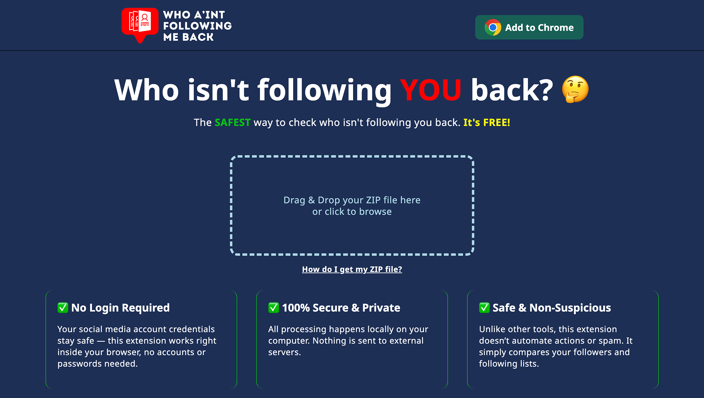

<h1 align="center">Who A'int Following Me Back</h1>

  A lightweight, privacy-focused Chrome extension that helps users easily compare their Instagram followers and following lists — without logging in or connecting to Instagram.

<h2>✨ Key Features</h2>
<ul>
  <li>100% offline — all processing happens in your browser</li>
  <li>No login or account access required</li>
  <li>No data collection or storage</li>
  <li>Safe, simple, and transparent</li>
</ul>

<h2>🔒 Privacy First</h2>

  The extension never collects, stores, or transmits any personal data. All processing takes place locally within your browser using the Instagram data file you upload (from the official “Download Your Information” feature).

